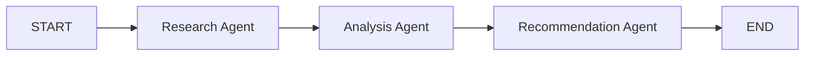
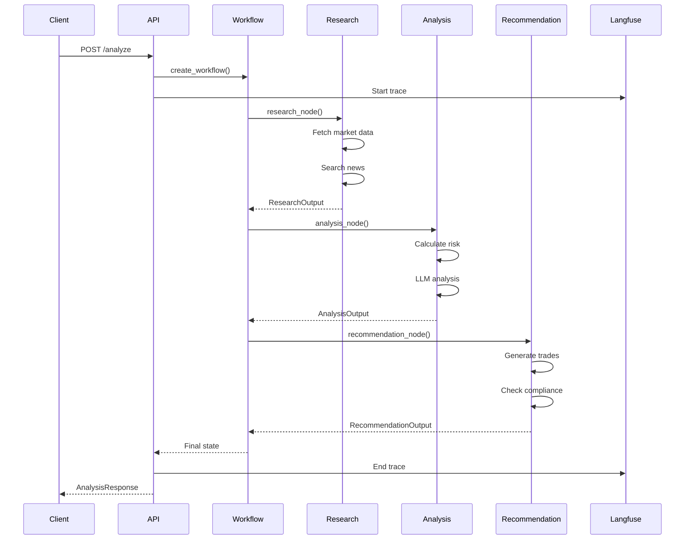
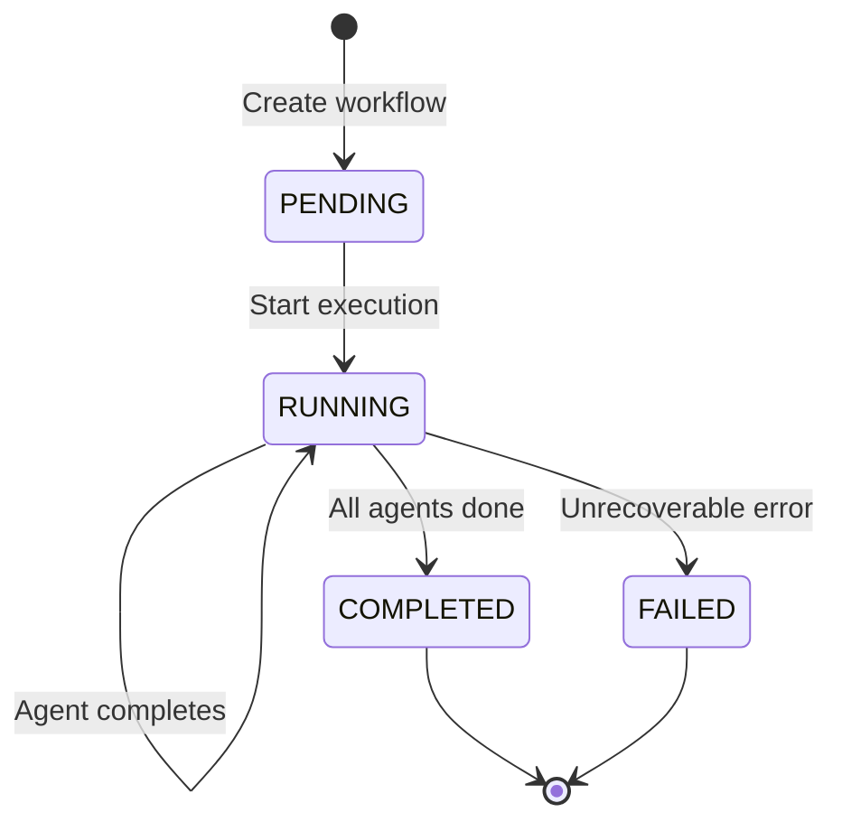

# Architecture

This document describes the architecture of the Multi-Agent Portfolio Advisor system.

## Overview

The Portfolio Advisor is an AI-powered system that analyzes investment portfolios using a multi-agent architecture. It combines market research, risk analysis, and trade recommendations into a cohesive workflow orchestrated by LangGraph.

```
┌─────────────────────────────────────────────────────────────────────┐
│                           FastAPI Server                             │
│                         (src/api/routes.py)                          │
└─────────────────────────────────────────────────────────────────────┘
                                    │
                                    ▼
┌─────────────────────────────────────────────────────────────────────┐
│                        LangGraph Workflow                            │
│                    (src/orchestration/workflow.py)                   │
│                                                                      │
│  ┌──────────────┐    ┌──────────────┐    ┌──────────────────────┐  │
│  │   Research   │───▶│   Analysis   │───▶│   Recommendation     │  │
│  │    Agent     │    │    Agent     │    │       Agent          │  │
│  └──────────────┘    └──────────────┘    └──────────────────────┘  │
└─────────────────────────────────────────────────────────────────────┘
                                    │
                    ┌───────────────┼───────────────┐
                    ▼               ▼               ▼
              ┌──────────┐   ┌──────────┐   ┌──────────────┐
              │ Langfuse │   │  Redis   │   │  PostgreSQL  │
              │ (traces) │   │ (cache)  │   │ (persistence)│
              └──────────┘   └──────────┘   └──────────────┘
```

## System Components

### API Layer (`src/api/`)

The API layer provides HTTP endpoints for interacting with the system.

| Component | File | Description |
|-----------|------|-------------|
| Routes | `routes.py` | FastAPI application with `/analyze` and health endpoints |
| Health | `health.py` | Health check system with component checkers |

**Key Features:**
- Request validation with Pydantic models
- CORS support for web clients
- Structured error responses
- OpenAPI documentation at `/docs`

### Agents (`src/agents/`)

Agents are specialized AI components that perform specific analysis tasks.

#### Research Agent (`research.py`)

**Purpose:** Gather market data and news for portfolio symbols.

**Inputs:**
- List of stock symbols
- Portfolio context
- User request

**Outputs:**
- Market data (prices, volumes, metrics)
- News articles with sentiment
- Research summary

**Tools Used:**
- Market data APIs (Yahoo Finance, Alpha Vantage)
- News search APIs

```python
class ResearchOutput:
    market_data: dict[str, SymbolData]
    news: list[NewsItem]
    summary: str
    symbols_researched: list[str]
```

#### Analysis Agent (`analysis.py`)

**Purpose:** Analyze portfolio risk and performance metrics.

**Inputs:**
- Research results
- Portfolio positions
- User request

**Outputs:**
- Risk metrics (volatility, beta, Sharpe ratio)
- Correlation analysis
- Benchmark comparison
- AI-generated recommendations

**Calculations:**
- Portfolio volatility using historical returns
- Beta against S&P 500
- Correlation matrix between holdings
- Attribution analysis

```python
class AnalysisOutput:
    risk_metrics: RiskMetrics
    correlations: list[CorrelationResult]
    benchmark_comparison: BenchmarkComparison
    attribution: AttributionResult
    recommendations: list[str]
    summary: str
```

#### Recommendation Agent (`recommendation.py`)

**Purpose:** Generate actionable trade recommendations.

**Inputs:**
- Analysis results
- Portfolio positions
- User preferences
- Account type (for tax considerations)

**Outputs:**
- Trade recommendations (BUY/SELL/HOLD)
- Tax impact analysis
- Execution cost estimates
- Compliance checks

**Tools Used:**
- Rebalancing calculator
- Tax impact analyzer
- Execution cost estimator
- Compliance checker

```python
class RecommendationOutput:
    trades: list[Trade]
    tax_impact: TaxImpact
    execution_costs: ExecutionCosts
    compliance: ComplianceResult
    summary: str
```

### Orchestration (`src/orchestration/`)

The orchestration layer manages workflow execution and state.

#### Workflow (`workflow.py`)

Uses LangGraph to define the agent execution graph:



**Workflow Features:**
- Sequential agent execution
- Error handling and recovery
- State persistence between nodes
- Trace propagation for observability

#### State Management (`state.py`)

The workflow uses a TypedDict to track state across agents:

```python
class PortfolioState(TypedDict):
    # Identifiers
    workflow_id: str
    trace_id: str

    # Input
    portfolio: dict[str, Any]
    symbols: list[str]
    user_request: str
    user_id: str | None

    # Agent outputs
    research: dict[str, Any] | None
    analysis: dict[str, Any] | None
    recommendation: dict[str, Any] | None

    # Execution tracking
    status: str
    current_agent: str | None
    started_at: str
    completed_at: str | None
    errors: list[str]
```

### Resilience (`src/resilience/`)

Production-grade resilience patterns for reliability.

| Component | File | Description |
|-----------|------|-------------|
| Circuit Breaker | `circuit_breaker.py` | Prevent cascade failures |
| Rate Limiter | `rate_limiter.py` | Control request rates |
| Caching | `cache.py` | Response caching with TTL |
| Degradation | `degradation.py` | Graceful degradation |

#### Circuit Breaker

Protects against failing dependencies:

```
CLOSED ──(failures > threshold)──▶ OPEN
   ▲                                  │
   │                            (timeout)
   │                                  ▼
   └────(success)──────────── HALF_OPEN
```

**States:**
- `CLOSED`: Normal operation
- `OPEN`: Failing fast, not calling dependency
- `HALF_OPEN`: Testing if dependency recovered

#### Graceful Degradation

When components fail, the system degrades gracefully:

| Level | Description | Example |
|-------|-------------|---------|
| FULL | All features available | Normal operation |
| CACHED_DATA | Using cached responses | Market data API down |
| MOCK_DATA | Using mock data | All APIs down |
| BASIC_ANALYSIS | Limited analysis | LLM unavailable |
| UNAVAILABLE | Service offline | Critical failure |

### Caching (`src/cache/`)

Multi-tier caching for performance:

```
Request ──▶ Memory Cache ──miss──▶ Redis Cache ──miss──▶ Source
              (1 min)               (15 min)
```

**Cache Strategies:**
- Market data: 1 minute TTL (real-time needs)
- News: 15 minute TTL (less time-sensitive)
- Analysis: 1 hour TTL (expensive to compute)

### Observability (`src/observability/`)

Comprehensive observability with Langfuse integration.

#### Trace Hierarchy

```
Trace (workflow_id)
├── Span: research_agent
│   ├── Span: fetch_market_data
│   └── Span: search_news
├── Span: analysis_agent
│   ├── Span: calculate_risk
│   └── Span: llm_analysis
└── Span: recommendation_agent
    ├── Span: generate_trades
    └── Span: compliance_check
```

#### Metrics Tracked

| Metric | Description |
|--------|-------------|
| `workflow.latency_ms` | Total workflow execution time |
| `agent.latency_ms` | Individual agent execution time |
| `llm.tokens` | Token usage per LLM call |
| `api.requests` | External API call counts |
| `cache.hit_rate` | Cache effectiveness |

### Tools (`src/tools/`)

Shared tools used by agents:

| Tool | Description |
|------|-------------|
| `market_data.py` | Fetch stock prices and metrics |
| `news_search.py` | Search financial news |
| `trade_generator.py` | Generate trade recommendations |
| `portfolio_analyzer.py` | Calculate portfolio metrics |

## Data Flow

### Request Flow



### State Transitions



## Security

### API Security

| Feature | Status | Description |
|---------|--------|-------------|
| CORS | ✅ | Configurable allowed origins |
| Rate Limiting | ✅ | 100 req/min per IP |
| Input Validation | ✅ | Pydantic models |
| Error Sanitization | ✅ | No stack traces in production |
| Authentication | 🔜 | API key / JWT (planned) |

### Data Security

- No PII stored in traces (configurable)
- Secrets managed via environment variables
- Database connections use SSL in production

## Deployment Architecture

### Docker Compose (Development)

```yaml
services:
  api:
    build: .
    ports: ["8000:8000"]
    depends_on: [postgres, redis]

  postgres:
    image: postgres:16

  redis:
    image: redis:7

  langfuse:
    image: langfuse/langfuse
    depends_on: [postgres]
```

### Production Considerations

| Component | Recommendation |
|-----------|----------------|
| API | Kubernetes with HPA |
| PostgreSQL | Managed service (RDS, Cloud SQL) |
| Redis | Managed service (ElastiCache, Memorystore) |
| Langfuse | Self-hosted or cloud |
| Secrets | Vault, AWS Secrets Manager |

## Configuration

### Environment Variables

| Variable | Description | Default |
|----------|-------------|---------|
| `ANTHROPIC_API_KEY` | Claude API key | Required |
| `DATABASE_URL` | PostgreSQL connection | Required |
| `REDIS_URL` | Redis connection | `redis://localhost:6379` |
| `LANGFUSE_PUBLIC_KEY` | Langfuse public key | Optional |
| `LANGFUSE_SECRET_KEY` | Langfuse secret key | Optional |
| `LOG_LEVEL` | Logging level | `INFO` |

### Feature Flags

| Flag | Description | Default |
|------|-------------|---------|
| `ENABLE_CACHING` | Enable Redis caching | `true` |
| `ENABLE_TRACING` | Enable Langfuse tracing | `true` |
| `MOCK_MARKET_DATA` | Use mock data (testing) | `false` |

## Design Decisions

### Why LangGraph?

LangGraph was chosen for workflow orchestration because:

1. **State Management**: Built-in support for complex state that flows between nodes
2. **Persistence**: Native checkpointing for long-running workflows
3. **Observability**: Integrates with LangSmith/Langfuse for tracing
4. **Flexibility**: Easy to add conditional branching or parallel execution

### Why Multi-Agent?

Single-agent architectures struggle with complex financial analysis:

| Aspect | Single Agent | Multi-Agent |
|--------|--------------|-------------|
| Specialization | General purpose | Domain experts |
| Context | Limited by window | Focused per task |
| Debugging | Opaque | Clear boundaries |
| Scaling | Monolithic | Independent |

### Why Pydantic?

Pydantic provides:
- Runtime validation of all inputs/outputs
- Automatic OpenAPI schema generation
- Type safety with IDE support
- Clear error messages for invalid data

## Future Architecture

### Planned Improvements

1. **Parallel Agents**: Research multiple symbols concurrently
2. **Human-in-the-Loop**: Approval workflow for large trades
3. **Streaming**: Real-time updates during analysis
4. **Multi-Model**: Use different LLMs for different tasks
5. **Plugins**: Extensible tool system for custom data sources

### Scalability Path

```
Current:  Single instance, synchronous
     ▼
Phase 1:  Horizontal scaling, async workers
     ▼
Phase 2:  Event-driven, message queues
     ▼
Phase 3:  Microservices, domain isolation
```

## Contributing

When adding new components:

1. **Agents**: Inherit from `BaseAgent`, define clear input/output types
2. **Tools**: Implement the tool protocol, add to agent toolkits
3. **Endpoints**: Add to `routes.py`, include OpenAPI docs
4. **Tests**: Unit tests required, integration tests encouraged

See [CONTRIBUTING.md](../CONTRIBUTING.md) for detailed guidelines.
